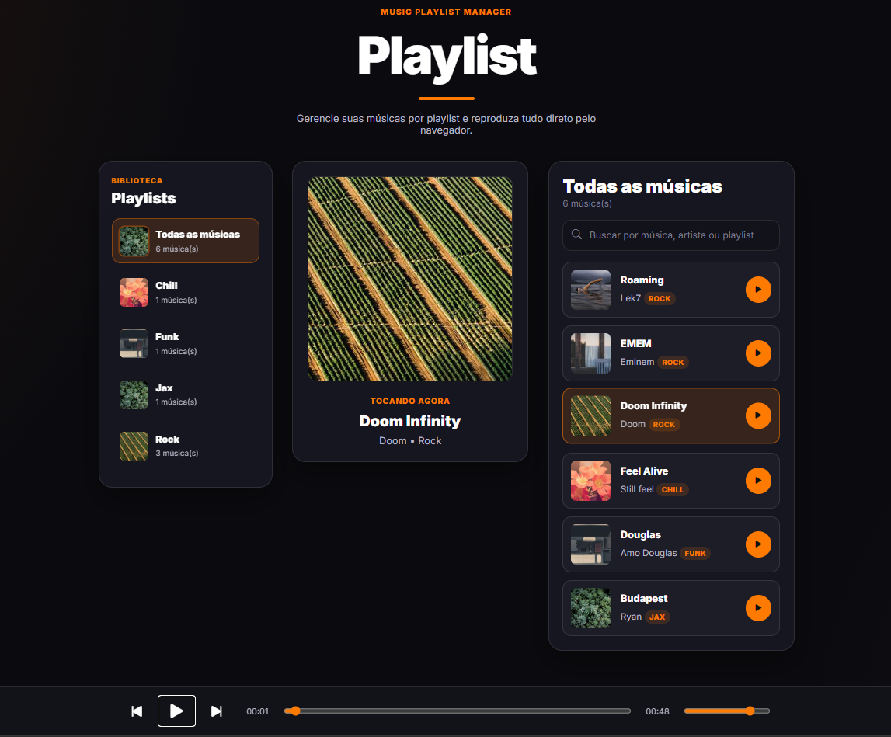
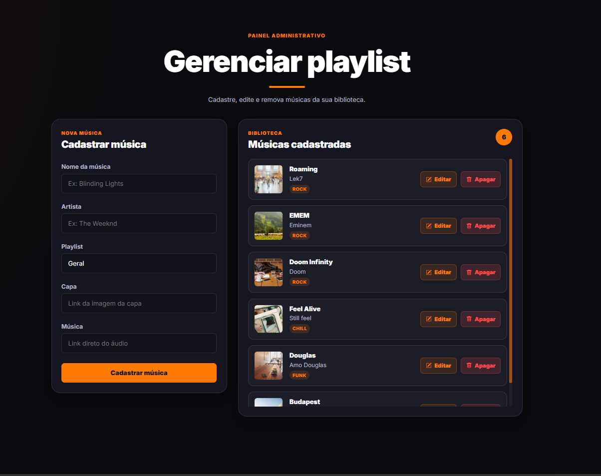

<div align="center">

# 🎵 Music Playlist Manager

Aplicação web para cadastrar, organizar, gerenciar e reproduzir músicas em playlists.

Projeto desenvolvido com **Node.js, Express, EJS, MongoDB Atlas e Mongoose**, com foco em praticar rotas, renderização server-side, integração com banco de dados, player customizado e operações CRUD.

</div>

---

<div align="center">

## 🖼️ Preview do projeto

### Página principal / Playlist



<br>
<br>

### Painel administrativo



</div>

---

<div align="center">

## 📌 Sobre o projeto

</div>

O **Music Playlist Manager** é uma aplicação web para gerenciamento de músicas em playlists.

A aplicação possui uma área administrativa onde é possível cadastrar músicas informando nome, artista, playlist, imagem de capa e link direto do áudio. As músicas cadastradas são salvas em um banco de dados **MongoDB Atlas** e exibidas na página principal da aplicação.

Na página principal, o usuário pode visualizar suas playlists, filtrar músicas por playlist, buscar por nome/artista/playlist e reproduzir as músicas através de um player customizado.

Este projeto foi originalmente desenvolvido como estudo e está sendo atualizado para melhorar organização, documentação, conexão com banco de dados, estrutura do código e apresentação visual.

---

<div align="center">

## 🚀 Funcionalidades

</div>

* Cadastro de músicas
* Listagem de músicas cadastradas
* Edição de músicas
* Remoção de músicas
* Organização por playlists
* Filtro por playlist
* Busca por nome, artista ou playlist
* Sidebar com playlists
* Capa automática para cada playlist
* Player de música customizado
* Controles de play, pause, próxima e anterior
* Barra de progresso da música
* Controle de volume
* Área administrativa para gerenciamento
* Sugestões de playlists no formulário
* Feedback visual para cadastro, edição e remoção
* Integração com MongoDB Atlas
* Renderização server-side com EJS
* Uso de variáveis de ambiente com `.env`

---

<div align="center">

## 🛠️ Tecnologias utilizadas

</div>

<div align="center">


</div>

<br>

Principais tecnologias utilizadas:

* HTML5
* CSS3
* JavaScript
* Node.js
* Express
* EJS
* MongoDB Atlas
* Mongoose
* Dotenv
* Nodemon
* Git e GitHub

---

<div align="center">

## ⚙️ Como executar o projeto

</div>

### 1. Clone o repositório

```bash
git clone https://github.com/Ryluna19/PMusica.git
```

### 2. Acesse a pasta do projeto

```bash
cd PMusica
```

### 3. Instale as dependências

```bash
npm install
```

### 4. Configure as variáveis de ambiente

Crie um arquivo `.env` na raiz do projeto com base no arquivo `.env.example`.

Exemplo:

```env
DB_URI=sua_string_de_conexao_mongodb
PORT=3000
```

### 5. Execute o projeto em modo desenvolvimento

```bash
npm run dev
```

Ou execute em modo normal:

```bash
npm start
```

A aplicação ficará disponível em:

```txt
http://localhost:3000
```

Área administrativa:

```txt
http://localhost:3000/admin
```

---

<div align="center">

## 📁 Estrutura básica

</div>

```txt
PMusica/
├── .github/
│   ├── preview-playlist.png
│   └── preview-admin.png
├── database/
│   └── db.js
├── model/
│   └── Music.js
├── public/
│   ├── script.js
│   └── style.css
├── views/
│   ├── admin.ejs
│   └── index.ejs
├── index.js
├── package.json
├── .env.example
└── README.md
```

---

<div align="center">

## 🧠 Aprendizados

</div>

Durante o desenvolvimento e atualização deste projeto, foram praticados conceitos como:

* Criação de servidor com Express
* Organização de rotas
* Renderização server-side com EJS
* Conexão com MongoDB Atlas
* Modelagem de dados com Mongoose
* Operações CRUD
* Manipulação de dados no front-end com JavaScript
* Criação de player customizado
* Filtro e busca em listas renderizadas
* Uso de variáveis de ambiente
* Organização de estrutura de projeto
* Documentação de projeto para GitHub

---

<div align="center">

## 🔄 Status do projeto

</div>

Projeto em processo de atualização e refinamento.

### Funcionalidades já implementadas

* CRUD de músicas
* Integração com MongoDB Atlas
* Área administrativa
* Playlists
* Busca
* Filtros
* Player customizado
* Feedback visual
* Layout responsivo
* Código reorganizado com comentários simples

### Melhorias planejadas

* Adicionar dados de exemplo para facilitar testes
* Melhorar validações dos formulários
* Refinar responsividade em telas menores
* Melhorar detalhes visuais da interface
* Atualizar prints conforme novas melhorias forem feitas

---

<div align="center">

## 🔐 Observação sobre variáveis de ambiente

</div>

O arquivo `.env` não deve ser enviado para o GitHub, pois contém dados sensíveis como a string de conexão com o banco de dados.

Por isso, o projeto utiliza um arquivo `.env.example` como modelo de configuração.

---

<div align="center">

## 👨‍💻 Autor

**Ryan Santos**

[GitHub](https://github.com/Ryluna19) • [LinkedIn](https://www.linkedin.com/in/ryan-bulhoes-santos-560b25225/)

</div>

---

<div align="center">

## 📄 Licença

Este projeto está sob a licença MIT.

</div>
